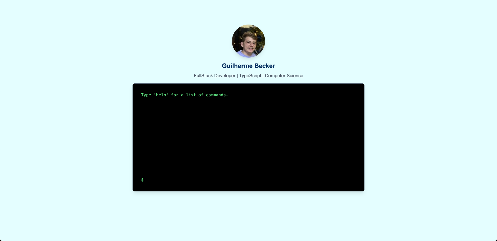

# Terminal Portfolio

Um portfólio interativo no estilo terminal onde os visitantes podem digitar comandos para descobrir informações sobre mim, meus projetos e habilidades.

## 🚀 Tecnologias Utilizadas

- **Next.js 15** - Framework React com renderização do lado do servidor
- **React 19** - Biblioteca para construção de interfaces
- **TypeScript** - Superset tipado de JavaScript
- **Tailwind CSS 4** - Framework CSS utilitário
- **Framer Motion** - Para animações fluidas

## ⌨️ Funcionamento

Este portfólio simula um terminal de linha de comando, onde os visitantes podem interagir digitando comandos específicos para descobrir informações sobre mim:

### Comandos Disponíveis

| Comando | Descrição |
|---------|-----------|
| `help` | Mostra a lista de comandos disponíveis |
| `whoami` | Exibe informações sobre mim como desenvolvedor |
| `contactme` | Abre o cliente de email para entrar em contato comigo |
| `programming` | Lista minhas principais linguagens de programação |
| `linkedin` | Redireciona para meu perfil do LinkedIn |
| `github` | Redireciona para meu perfil do GitHub |
| `projects` | Navega para a página de projetos |
| `resume` | Abre meu currículo em PDF |
| `clear` | Limpa o terminal |

## 📋 Estrutura do Projeto

```
├── src/
│   ├── app/               # Diretório raiz da aplicação Next.js
│   │   ├── projects/      # Rota para a página de projetos
│   │   ├── globals.css    # Estilos globais
│   │   ├── layout.tsx     # Layout principal da aplicação
│   │   └── page.tsx       # Página inicial
│   ├── assets/            # Recursos estáticos como imagens
│   ├── components/        # Componentes React reutilizáveis
│   │   ├── header/        # Componente de cabeçalho
│   │   ├── layoutWrapper/ # Wrapper para layout condicional
│   │   ├── terminal/      # Componente principal do terminal
│   │   └── title/         # Componente para o título da página
```

## 🔧 Instalação e Uso

```bash
# Clone o repositório
git clone https://github.com/seu-usuario/terminal-portfolio.git

# Navegue até o diretório do projeto
cd terminal-portfolio

# Instale as dependências
npm install
# ou
yarn install

# Execute em modo de desenvolvimento
npm run dev
# ou
yarn dev
```

A aplicação estará disponível em `http://localhost:3000`

## 🌐 Recursos Adicionais

- Responsive design para funcionar em dispositivos móveis e desktop
- Interface minimalista inspirada em terminais Unix/Linux
- Navegação entre páginas integrada com Next.js
- Estilização moderna com Tailwind CSS

## 📞 Contato

- **Email**: guilhermegbecker@gmail.com
- **LinkedIn**: [Guilherme Gottschefski Becker](https://www.linkedin.com/in/guilherme-gottschefski-becker/)
- **GitHub**: [guiiBecker](https://github.com/guiiBecker)

## 📸 Preview do Projeto


